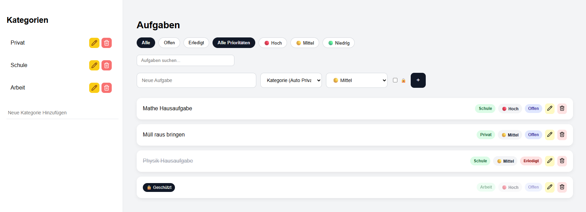
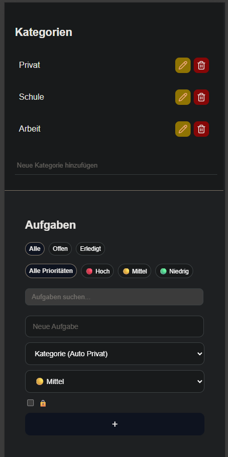

# 📝 TODO Web Application

A modern Single-Page TODO web application built with **Vue 3**, **Pinia**, and **Vite**.

This project was developed as part of a school project and includes task management, category organization, filtering systems, and advanced features like priority levels and password-protected tasks.

---

## 🚀 Features

### ✅ Task Management

* Create tasks with free text
* Mark tasks as **Open** or **Completed**
* Edit and delete tasks

### 🗂 Category Management

* Create custom categories (e.g., Home, School, Work)
* Assign tasks to categories
* Categories cannot be deleted while containing tasks

### 🔎 Filtering & Search

* Filter by status:

  * All
  * Open
  * Completed
* Filter by priority
* Live search by task text

### ⭐ Priority System (Optional Feature)

* High 🔴
* Medium 🟡
* Low 🟢
* Filter tasks by priority

### 🔒 Password Protection (Optional Feature)

* Tasks can be protected with a password
* Content is hidden until unlocked

### 💾 Data Persistence

* All tasks and categories are saved using **LocalStorage**
* Data remains even after browser refresh

### 📱 Responsive Design

* Works on Desktop, Tablet, and Mobile devices

### ⚡ Single-Page Application

* No page reloads
* Fast and smooth user experience

---

## 🛠 Tech Stack

* **Vue 3** — Frontend Framework
* **Pinia** — State Management
* **Vite** — Build Tool
* **LocalStorage** — Data Persistence
* **Lucide Icons** — UI Icons

---

## 📦 Project Setup

```bash
npm install
```

### ▶ Development Server

```bash
npm run dev
```

### 🏗 Production Build

```bash
npm run build
```

### 🔍 Lint Code

```bash
npm run lint
```

---

## 🧪 Testing

Manual browser tests were performed on:

* Google Chrome
* Microsoft Edge
* Mozilla Firefox

Test cases include:

* Task creation & deletion
* Category assignment
* Filtering & searching
* Password protection
* Data persistence after reload

---

## 📁 Project Structure

```
src/
 ├─ components/
 │   ├─ CategoryManager.vue
 │   ├─ TaskManager.vue
 │   ├─ TaskManagerItem.vue
 │
 ├─ stores/
 │   ├─ categoryStore.js
 │   ├─ taskStore.js
 │
 ├─ App.vue
 └─ main.js
```

---

## 👨‍💻 Author

**Osman Türkarslan**

---

## 📄 License

This project was created for educational purposes.

---

## 📸 Screenshots

Below is a preview of the TODO application interface:

### Desktop


### Mobile


---

## Deployment

Project deployed with github pages.

---

## Live

URL: https://osmanturkarslan.github.io/todo-app/